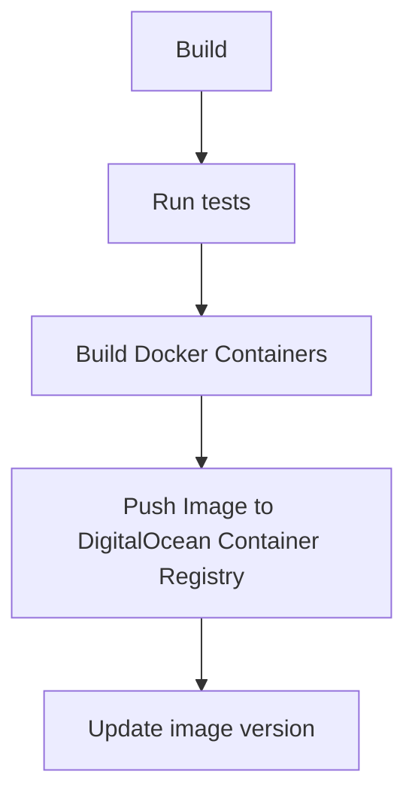
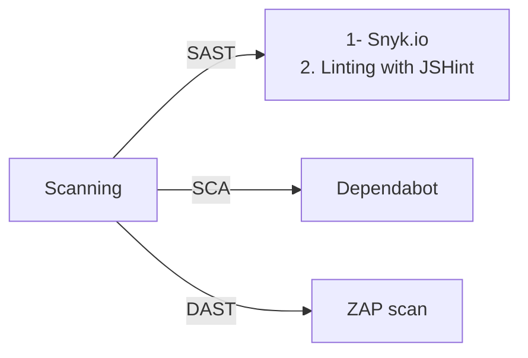

# Frontend (Practice Module)

### Getting Started

1. Ensure node is installed on your machine
2. Install Prettier extention on VSCode

### Commands

#### npm

`npm i` - install project dependencies  
`npm run prepare` to setup husky (one-time setup)  
`npm run dev` - start application locally on localhost:3000

#### Docker

```sh
# build a docker container named feats-frontend with the latest tag
docker build -t feats-frontend .

# run the docker container on port 3000
docker run -d -p 3000:80 feats-frontend
```

### Running Tests

Run unit tests by running the following command:
`npm run test`

### Folder Structure

```
🗂️── __tests__               Unit tests
🗂️── dist                    Compiled files
🗂️── src                     Source files
|  ├──🗂️ __mock              Mock data
|  ├──🗂️ components          Components used throughout the application
|  ├──🗂️ hooks               Custom React hooks
|  ├──🗂️ layouts             Overall application presentation layer
|  ├──🗂️ pages               Specific pages of application
|  ├──🗂️ routes              Routing for different pages
|  ├──🗂️ sections            Module-specific views
|  ├──🗂️ theme               Themes for components and application
|  ├──🗂️ utils               Other helpful utility functions
|  ├── README.md
|  └── package.json          Project dependencies
└── ...
```

### Commit Message Guidelines

`husky` is used as a commit linting tool to check and enforce a [commit message guideline](https://github.com/angular/angular/blob/22b96b9/CONTRIBUTING.md#-commit-message-guidelines).

Get husky setup by running `npm run prepare`.

Each commit message consists of a header, a body and a footer. The header has a special format that includes a type, a scope and a subject:

```
<type>(<scope>): <subject>
<BLANK LINE>
<body>
<BLANK LINE>
<footer>
```

Example:

```
feat: add user login page
```

## Continuous Integration

The project is using [GitHub Actions](https://docs.github.com/en/actions) for the Continuous Integration (CI) pipeline.

Refer to `.github/workflows/build.yml` file for the detailed steps in the CI pipeline.

The following diagram illustrates the overview of the CI workflow:





## Continuous Deployment

Continuous Deployment is done using [ArgoCD](https://argo-cd.readthedocs.io/en/stable/). The CI pipeline will end with updating the application's image version onto the kubernetes yaml file found in the [deployment repo](https://github.com/dmss-group3-practice-module/deployment). There will be an ArgoCD agent in the kubernetes cluster on hosted on DigitalOcean which listens to version changes in the `deployment` repository.
